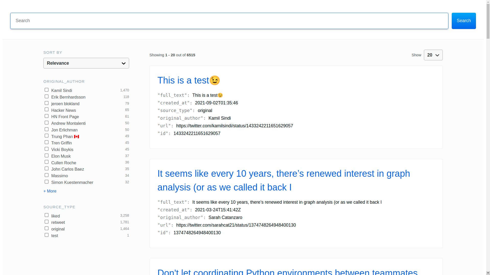

# Tweeter

Archive and search your tweets and liked tweets using AWS Lambda, DynamoDB and Elasticsearch.



*Note: this project is primarily being used a test bed for figuring out best practices with AWS Lambda*

## Requirements

**Make sure you have the following installed before you proceed**

* AWS CLI - [Install AWS CLI](https://docs.aws.amazon.com/cli/latest/userguide/cli-chap-install.html) configured with Administrator permission
* SAM CLI - [Install the SAM CLI](https://docs.aws.amazon.com/serverless-application-model/latest/developerguide/serverless-sam-cli-install.html)
* AWS Amplify - [Install AWS Amplify](https://docs.amplify.aws/cli/start/install/)
* [Python 3](https://www.python.org/downloads/)
* Docker - [Install Docker community edition](https://hub.docker.com/search/?type=edition&offering=community)

## Setup

### Twitter API key setup

Set up a [Twitter Developer account](https://developer.twitter.com/en). Once you are signed up, create an app.

Add the credentials to [SSM Parameter Store](https://docs.aws.amazon.com/systems-manager/latest/userguide/systems-manager-paramstore.html):

```bash
aws ssm put-parameter --name /tweeter/twitter/consumer_key --value <your consumer key value> --type SecureString --overwrite
aws ssm put-parameter --name /tweeter/twitter/consumer_secret --value <your consumer secret value> --type SecureString --overwrite
aws ssm put-parameter --name /tweeter/twitter/access_token --value <your access token value> --type SecureString --overwrite
aws ssm put-parameter --name /tweeter/twitter/access_token_secret --value <your access token secret value> --type SecureString --overwrite
```

### Elastic Cloud setup

**Elastic Cloud is not free**

Set up an account with [Elastic Cloud](https://www.elastic.co/). Create a deployment and then an Elastic App Search engine. Retrieve the private key from the Credentials section.

Add the private key to SSM.

```bash
aws ssm put-parameter --name /tweeter/es/private_key --value <your password> --type SecureString --overwrite
```

Also, update the configuration in `ui/src/config/engine.json`, specifically the values of `endpointBase` and `searchKey`.

## Deploy the backend

Build and deploy your application for the first time by running the following commands in your shell:

```bash
make build
make deploy.guided
```

The first command will **build** the source of your application within a Docker container. The second command will **package and deploy** your application to AWS. Guided deploy means SAM CLI will ask you about the name of your deployment/stack, AWS Region, and whether you want to save your choices, so that you can use `make deploy` next time.

## Deploy the frontend

In the `ui` directory, deploy the application with AWS Amplify.

```bash
amplify publish
```

## Use the SAM CLI to build and test locally

Whenever you change your application code, you'll have to run build command:

```bash
make build
```

The SAM CLI installs dependencies defined in `poller/requirements.txt`, creates a deployment package, and saves it in the `.aws-sam/build` folder.

Test a single function by invoking it directly with a test event:

```bash
make invoke.poller
make invoke.indexer
```

### Working with localstack

Validate DynamoDB was populated using Localstack:

```bash
docker-compose up -d
make invoke.poller
aws --endpoint-url=http://localhost:4566 dynamodb scan --table-name TweetsTable --max-items 10
```

> An event is a JSON document that represents the input that the function receives from the event source. Test events are included in the `events` folder in this project.

## Fetch, tail, and filter Lambda function logs

To simplify troubleshooting, SAM CLI has a command called `sam logs`. `sam logs` lets you fetch logs generated by your deployed Lambda function from the command line. In addition to printing the logs on the terminal, this command has several nifty features to help you quickly find the bug.

`NOTE`: This command works for all AWS Lambda functions; not just the ones you deploy using SAM.

```bash
sam logs -n TweeterPoller --stack-name tweeter --tail
```

You can find more information and examples about filtering Lambda function logs in the [SAM CLI Documentation](https://docs.aws.amazon.com/serverless-application-model/latest/developerguide/serverless-sam-cli-logging.html).

## CI/CD with GitHub

### Backend

Create a user `github` with the following policy: https://docs.aws.amazon.com/serverless-application-model/latest/developerguide/sam-permissions.html.

Create secrets with AWS.

```bash
AWS_ACCESS_KEY_ID
AWS_SECRET_ACCESS_KEY
```

### Frontend

Follow the AWS Amplify console to configure the frontend.

## Notes
1. Set `StreamModeEnabled` to `false` in `samconfig.toml` the first time you run the poller to get all tweets.
2. Twitter apparently only allows access to a user's most recent 3,240 tweets with this method.
3.  This probably isn't the best use case for Lambda, which has a timeout of 15 minutes. Ideally we should be calling Fargate for long running task. That said, in practice, because of the limitations of Twitter's API, getting all the available tweets is well within that limit.


## Appendix: Powertools

**Tracing**

[Tracer utility](https://awslabs.github.io/aws-lambda-powertools-python/core/tracer/) patches known libraries, and trace the execution of this sample code including the response and exceptions as tracing metadata - You can visualize them in AWS X-Ray.

**Logger**

[Logger utility](https://awslabs.github.io/aws-lambda-powertools-python/core/logger/) creates an opinionated application Logger with structured logging as the output, dynamically samples 10% of your logs in DEBUG mode for concurrent invocations, log incoming events as your function is invoked, and injects key information from Lambda context object into your Logger - You can visualize them in Amazon CloudWatch Logs.

**Metrics**

[Metrics utility](https://awslabs.github.io/aws-lambda-powertools-python/core/metrics/) captures cold start metric of your Lambda invocation, and could add additional metrics to help you understand your application KPIs - You can visualize them in Amazon CloudWatch.

## License

MIT
